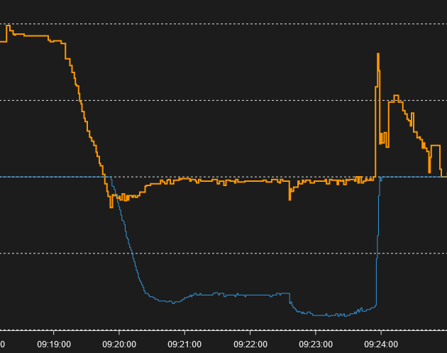

# Energy Router

## When is this project useful?

- You have some energy production (typically solar panels).

- You want to self-consume as much as possible of this energy.

- You have a device (typically a water heater) which could consume the part of the energy, which would otherwise be injected into the public electricity grid.

- You have an energy meter which measures the power consumed by your household (typically a Shelly EM). The power can be either positive (power is consumed) or negative (power is injected into the public electricity grid).

## The Energy Router at work

The orange line corresponds to the grid power readings of the energy meter, the central horizontal line being zero.

The blue line corresponds to the power sent to the water heater (multiplied by -1). We see the regulation at work, as soon as the orange line reaches negative values.

For more information how to put this together, please see the [wiki](https:./EnergyRouter/wiki).
